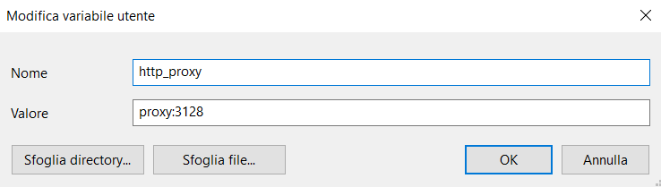

# Proci - WebApp (admin)

# Configurazione

- includere il database dal file [createdb.sql](createdb.sql)  
  ```MySQL
  create database dbproci;
  use dbproci;
  source C:/xampp/htdocs/WebApp/createdb.sql;
  ```
  
- aggiungere un account di prova al database (per testare le funzionalità del sito)  
  ```MySQL
  insert into utente (user, password) values ('proci', SHA2('password', 256));
  ```
  
- configurare il db e il proprio account SQL nel file [config.ini](config.ini) (crearlo se non è già presente)  
  ```ini
  [mysql]
  user = root
  password = admin
  host = localhost
  dbname = dbproci
  ```

# Composer

Installare [composer](https://getcomposer.org/doc/00-intro.md#installation-windows "Composer Download") (gestore di dipendenze PHP)

Installare le dipendenze del progetto:  
eseguire il seguente comando da shell dentro la cartella del progetto (dove ci sono i file *composer.json* e *composer.lock*)

    composer install


> Se si sta lavorando da scuola, bisogna settare il **proxy** come variabile d'ambiente windows: http_proxy proxy:3128  
   
 Bisogna poi ricordarsi di toglierla a casa, oppure non andranno molti servizi (composer non è l'unico programma che utilizza questa variabile)


# Suddivisione File Progetto

- src - codice
  - . - codice php generale
  - css - codice css
  - js - codice javascript
  - admin - codice php relativo all'admin (webapp)
  - user - codice php relativo all'utente normale, fornisce il JSON all'app android
- res - risorse (immagini, come i favicon)

