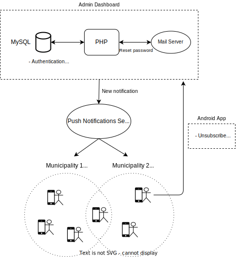

# BrianzApp - Admin dashboard

<div align="center">
  
</div>
<br />

Promptly send public utility news addressed to the citizens of the agreed municipalities


## Screenshots

<div align="center">
  
  <br />
  Homepage
</div>
<br />
<div align="center">
  
  <br />
  Filter the sent notifications displayed
</div>
<br />
<div align="center">
  
  <br />
  Send a new notification
</div>
<br />
<div align="center">
  
  <br />
  Mobile ready
</div>
<br />


## Architecture

<div align="center">
  
</div>

## Setup

The project has been built with PHP 7.  
To access the WebApp, type the path to the `public` folder in the browser

#### Composer

Install [Composer](https://getcomposer.org/ "Composer Homepage")  

Install project dependencies: `composer install`


#### Database

Create the database by connecting to MySQL and running [createdb.sql](createdb.sql)  
  ```MySQL
  create database dbname;
  use dbname;
  source createdb.sql;
  ```
  
Add an account into the database
  ```MySQL
  insert into utente (user, password) values ('user@email.it', SHA2('password', 256));
  ```


#### Configuration

  
Configure host, database connection, mail server inside the file **private/config.ini.php**  
  Create it if not already present:


```php
;<?php  // This file is to be left as it is, it is both a valid php and ini file, so if the private folder is somehow accessed, there is still another security layer because the php part will stop the execution and no data will be displayed in the HTML source of the page.  
;die(); // For further security  
;/*

[mysql]
user = usernameMySQL
password = passwordMySQL
host = localhost
dbname = dbname

[email]
username = usernameEmail
password = passwordEmail

;*/

;?>
```

#### Mail server settings

Change PHPMailer settings in sendmail.php


#### Push notifications service

OneSignal is used to send push notifications to devices.  
To use a different service, modify the implementation of sendMessage() in new_notification.php


## Project Structure


```
project
│   README.md               This file
│   createdb.sql            SQL script to create the database
│   composer.*              Composer dependencies
│
└───private             Sensitive data to which access 
│   │                   must be restricted
│   │   logs
│   │   config.ini.php
│
└───public              Publicly accessible pages
│   │   .                 General PHP code
│   │   index.php         Start page
│   │   css               Styles
│   │   js                Scripts
│   │   res               Image assets
│   │   admin             PHP code related to admin dashboard
│   │   user              PHP code related to user: provides
│                         JSON data to the android app
│   
└───root                Files to be placed in the root directory
    │  ...              (such as htdocs) of the website that 
                        provides hosting, hence outside the 
                        WebApp folder
```

